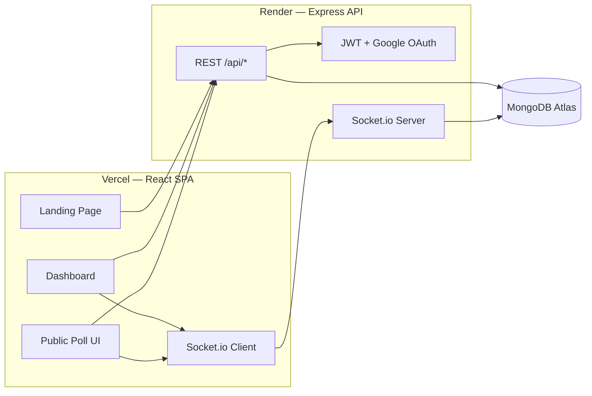

# Votora — Real-Time Polling & Live Feedback Platform

**Votora** is a production-grade, full-stack platform for creators, educators, and event hosts to run immersive, real-time polls and quizzes. It ships live analytics, anti-cheat for quiz mode, dual timing (auto-expiry + manual live timer), and a premium dark UI — optimized for both hosts and respondents.

| Service | Live URL |
|---------|----------|
| **Frontend (Vercel)** | [https://votora-real-time-polling-platform-psi.vercel.app](https://votora-real-time-polling-platform-psi.vercel.app/) |
| **Backend API (Render)** | [https://votora-real-time-polling-platform.onrender.com](https://votora-real-time-polling-platform.onrender.com) |
| **API Health Check** | [https://votora-real-time-polling-platform.onrender.com/api/health](https://votora-real-time-polling-platform.onrender.com/api/health) |
| **Source** | [github.com/Ayush-Panda-design/Votora-Real-Time-Polling-Platform](https://github.com/Ayush-Panda-design/Votora-Real-Time-Polling-Platform) |

---

## Table of Contents

- [Key Features](#-key-features)
- [Tech Stack](#-tech-stack--architecture)
- [Architecture Overview](#architecture-overview)
- [Landing Page Animations](#-landing-page-animations)
- [Local Development](#-local-development-setup)
- [Production Deployment](#-production-deployment)
- [Environment Variables](#-environment-variables)
- [API Overview](#-api-overview)
- [Authentication](#-authentication)
- [Real-Time (Socket.io)](#-real-time-socketio)
- [Folder Structure](#-folder-structure)
- [Troubleshooting](#-troubleshooting)
- [Hackathon Compliance](#-hackathon-requirements-compliance-checklist)

---

## Key Features

### For Creators

- **Dynamic poll & quiz creation** — MCQ polls, scored quizzes with correct answers, descriptions, and optional PIN locks.
- **Dual time management**
  - *Auto-expiry* — set a date/time for automatic closure.
  - *Manual live timer* — respondents wait in a lobby until you click **Start** for synchronized competitive sessions.
- **Anti-cheat (quiz mode)** — tab switching or window defocus disqualifies the respondent and auto-submits progress.
- **Live dashboard & analytics** — real-time vote counts, bar/pie charts (Recharts), MongoDB aggregation pipelines.
- **Presentation mode** — clean, distraction-free view for screen sharing.
- **Publish results** — optionally expose final analytics on the public poll link.
- **CSV export** — download response data for external analysis.
- **Section guides** — contextual in-page tips on Dashboard, Create Poll, Analytics, Profile, and Help (dismissible per page).

### For Respondents

- **Frictionless participation** — anonymous polls require no login.
- **Live sync** — instant updates via WebSockets; no manual refresh.
- **Cross-device UI** — responsive, glassmorphic design for mobile, tablet, and desktop.
- **Smart redirect** — if a poll requires auth, login returns the user to the poll they were trying to access.

---

## Tech Stack & Architecture

### Frontend

| Layer | Technology |
|-------|------------|
| Framework | React 18 + Vite |
| State | Redux Toolkit |
| Styling | Tailwind CSS + custom CSS |
| Motion | Framer Motion |
| Charts | Recharts |
| Routing | React Router v6 |
| Real-time client | Socket.io-client |

### Backend

| Layer | Technology |
|-------|------------|
| Runtime | Node.js |
| Framework | Express.js |
| Database | MongoDB (Mongoose) |
| Real-time | Socket.io (poll-scoped rooms) |
| Auth | JWT (httpOnly cookies + Bearer token fallback) + Google OAuth 2.0 |
| Validation | express-validator |
| Security | Rate limiting, CORS allowlist, CSRF on auth routes |

### Security Highlights

- **Clean architecture** — Routes → Controllers → Services → Models.
- **Cross-origin auth** — production uses `SameSite=None; Secure` cookies **and** returns `accessToken` in JSON for Bearer header fallback (Vercel ↔ Render).
- **Rate limiting** — general API + stricter auth endpoint limits.
- **Atomic voting** — MongoDB `$inc` prevents double-vote race conditions.
- **Global error handling** — standardized `ApiError` JSON responses.

---

## Architecture Overview



**Request flow (typical poll vote):**

1. Respondent opens public poll URL → `GET /api/polls/public/:pollCode`
2. Submits answer → `POST /api/responses/:pollId`
3. Server persists response, emits socket event to poll room
4. Creator dashboard chart updates in real time

---

## Landing Page Animations

The marketing landing page at `/` uses **12 distinct motion effects** inspired by modern SaaS sites (Stripe, Linear, Vercel-style orbs, marquee tickers, and scroll reveals):

| # | Animation | Location | Technique |
|---|-----------|----------|-----------|
| 1 | **Typewriter hero** | Hero headline | Character-by-character text reveal |
| 2 | **Floating phone mockup** | Hero visual | Framer Motion `y` oscillation + shadow |
| 3 | **Live poll bars** | Phone mockup | Interval-driven bar height updates |
| 4 | **Floating stat chips** | Hero overlay | Staggered float + fade-in |
| 5 | **Navbar blur on scroll** | Top nav | Scroll listener → backdrop blur |
| 6 | **Feature card reveal** | Features grid | `whileInView` stagger |
| 7 | **Gallery hover zoom** | Gallery images | CSS scale on hover |
| 8 | **Drifting gradient orbs** | Full-page background | `LandingBackground` — 3 orbs + grid |
| 9 | **Step card stagger** | How it works | Scroll-triggered card entrance |
| 10 | **SVG line draw** | How it works | `strokeDashoffset` animation |
| 11 | **Infinite marquee** | Use-case ticker | `LandingMarquee` — linear loop |
| 12 | **Dashboard UI stack** | Showcase section | Layered cards + spring bar chart |

Landing components live in `client/src/features/auth/components/landing/`.

---

## Local Development Setup

### Prerequisites

- Node.js 18+
- MongoDB (local or [MongoDB Atlas](https://www.mongodb.com/atlas))
- Google Cloud Console project (for Google Sign-In)

### Quick start (recommended)

From the project root:

```bash
git clone https://github.com/Ayush-Panda-design/Votora-Real-Time-Polling-Platform.git
cd Votora-Real-Time-Polling-Platform
npm install
npm run setup      # copies .env.example → .env for server & client
npm run install:all
npm run dev        # server :5013 + client :5173
```

Open [http://localhost:5173](http://localhost:5173).

### Manual setup

**Backend** (`server/`):

```bash
cd server
npm install
cp .env.example .env   # then edit values
npm run dev
```

**Frontend** (`client/`):

```bash
cd client
npm install
cp .env.example .env   # then edit values
npm run dev
```

### Docker

```bash
docker compose up --build
```

Client: `http://localhost:5173` · API: `http://localhost:5013`

---

## Production Deployment

Votora uses a **split deployment**: React SPA on **Vercel**, Express API on **Render**, database on **MongoDB Atlas**.

### 1. MongoDB Atlas

1. Create a free cluster at [mongodb.com/atlas](https://www.mongodb.com/atlas).
2. Create a database user with read/write access.
3. **Network Access** → add `0.0.0.0/0` (or Render's IP ranges) so Render can connect.
4. Copy the connection string → `MONGO_URI`.

### 2. Backend — Render

1. Connect the GitHub repo at [dashboard.render.com](https://dashboard.render.com).
2. Use the included `render.yaml` blueprint, or create a **Web Service**:
   - **Root directory:** `server`
   - **Build command:** `npm install`
   - **Start command:** `npm start`
   - **Health check path:** `/api/health`
3. Set environment variables (see [Environment Variables](#-environment-variables)).
4. **Critical:** `CLIENT_URL` must exactly match your Vercel frontend URL (no trailing slash):

   ```
   CLIENT_URL=https://votora-real-time-polling-platform-psi.vercel.app
   ```

   For multiple frontends, use comma-separated origins:

   ```
   CLIENT_URL=https://votora-real-time-polling-platform-psi.vercel.app,https://your-preview.vercel.app
   ```

> **Note:** Render free tier spins down after inactivity. First request may take ~30–60 seconds (cold start).

### 3. Frontend — Vercel

1. Import the repo at [vercel.com](https://vercel.com).
2. Vercel reads root `vercel.json`:
   - Installs & builds from `client/`
   - Output: `client/dist`
   - SPA rewrites + `Cross-Origin-Opener-Policy: same-origin-allow-popups` (required for Google Sign-In popups)
3. Set Vercel environment variables (see below).
4. Redeploy after any env change.

### 4. Google OAuth (production)

In [Google Cloud Console](https://console.cloud.google.com/) → **APIs & Services → Credentials**:

1. Create an **OAuth 2.0 Client ID** (Web application).
2. **Authorized JavaScript origins:**
   - `https://votora-real-time-polling-platform-psi.vercel.app`
   - `http://localhost:5173` (for local dev)
3. **Authorized redirect URIs:** same origins (Google One Tap / popup flow).
4. Use the same Client ID in both `GOOGLE_CLIENT_ID` (server) and `VITE_GOOGLE_CLIENT_ID` (client).

---

## Environment Variables

### Server (`server/.env`)

| Variable | Required | Description |
|----------|----------|-------------|
| `PORT` | No | Default `5013` |
| `NODE_ENV` | Yes (prod) | `production` on Render |
| `CLIENT_URL` | Yes | Frontend origin(s), comma-separated |
| `MONGO_URI` | Yes | MongoDB connection string |
| `JWT_SECRET` | Yes | Long random secret |
| `JWT_EXPIRES_IN` | No | Default `7d` |
| `GOOGLE_CLIENT_ID` | Yes* | Google OAuth client ID |

\*Google Sign-In buttons are hidden if unset.

### Client (`client/.env`)

| Variable | Required | Description |
|----------|----------|-------------|
| `VITE_API_URL` | Yes | e.g. `https://votora-real-time-polling-platform.onrender.com/api` |
| `VITE_SOCKET_URL` | Yes | e.g. `https://votora-real-time-polling-platform.onrender.com` |
| `VITE_GOOGLE_CLIENT_ID` | Yes* | Same as server `GOOGLE_CLIENT_ID` |

**Production example:**

```env
# client/.env (Vercel)
VITE_API_URL=https://votora-real-time-polling-platform.onrender.com/api
VITE_SOCKET_URL=https://votora-real-time-polling-platform.onrender.com
VITE_GOOGLE_CLIENT_ID=your_id.apps.googleusercontent.com
```

```env
# server/.env (Render)
NODE_ENV=production
CLIENT_URL=https://votora-real-time-polling-platform-psi.vercel.app
MONGO_URI=mongodb+srv://...
JWT_SECRET=your_secure_secret
GOOGLE_CLIENT_ID=your_id.apps.googleusercontent.com
```

---

## API Overview

Base URL (production): `https://votora-real-time-polling-platform.onrender.com/api`

| Method | Endpoint | Auth | Description |
|--------|----------|------|-------------|
| GET | `/health` | — | Health check `{ status: 'ok' }` |
| POST | `/auth/signup` | — | Register |
| POST | `/auth/login` | — | Email/password login |
| POST | `/auth/google` | — | Google ID token login |
| GET | `/auth/me` | Optional | Current user |
| POST | `/auth/logout` | Yes | Clear session |
| GET | `/polls` | Yes | Creator's polls |
| POST | `/polls` | Yes | Create poll |
| GET | `/polls/public/:pollCode` | — | Public poll for respondents |
| POST | `/responses/:pollId` | Optional | Submit vote/response |
| GET | `/analytics/:pollId` | Yes | Poll analytics |

Full route definitions: `server/src/routes/`.

---

## Authentication

Votora supports **email/password** and **Google Sign-In**.

### Local development

JWT is stored in an `httpOnly` cookie (`SameSite=Lax`).

### Production (Vercel + Render)

Because the frontend and API are on different origins, cookies alone may not persist. The app uses a **dual strategy**:

1. Server sets `httpOnly` cookie with `SameSite=None; Secure`
2. Login/Google responses also return `accessToken` in JSON
3. Client stores token in `sessionStorage` and sends `Authorization: Bearer <token>` on API calls

Key files:

- `server/src/controllers/auth.controller.js` — token issuance
- `client/src/services/authSession.js` — token storage
- `client/src/services/api.js` — Axios interceptor
- `client/src/routes/ProtectedRoute.jsx` — route guard

---

## Real-Time (Socket.io)

- Client connects to `VITE_SOCKET_URL` with optional auth token in handshake.
- Poll-scoped rooms: creators and respondents join the same room for live vote updates and participant counts.
- Config: `server/src/config/socket.js`, `client/src/socket/`.

---

## Folder Structure

```text
Votora-Real-Time-Polling-Platform/
├── client/                          # React frontend (Vercel)
│   ├── src/
│   │   ├── components/ui/           # Button, Modal, SectionGuide, Logo, …
│   │   ├── features/
│   │   │   ├── auth/                # Login, Signup, Landing + landing/ animations
│   │   │   ├── polls/               # Dashboard, create/edit, presentation
│   │   │   ├── publicPoll/          # Respondent voting UI
│   │   │   ├── analytics/           # Charts
│   │   │   └── help/                # In-app help
│   │   ├── layouts/                 # DashboardLayout, AuthLayout
│   │   ├── routes/                  # ProtectedRoute, PublicRoute
│   │   ├── services/                # api.js, authSession.js
│   │   ├── socket/                  # Socket.io client
│   │   └── store/                   # Redux slices
│   ├── vercel.json                  # (referenced from root vercel.json)
│   └── .env.example
│
├── server/                          # Express API (Render)
│   ├── src/
│   │   ├── config/                  # DB, socket, clientOrigins, multer
│   │   ├── controllers/
│   │   ├── middleware/              # auth, rateLimit, errorHandler
│   │   ├── models/
│   │   ├── routes/
│   │   ├── services/
│   │   └── validators/
│   └── .env.example
│
├── vercel.json                        # Vercel build + COOP headers
├── render.yaml                        # Render blueprint
└── docker-compose.yml
```

---

## Troubleshooting

### CORS errors in browser console

- Ensure Render `CLIENT_URL` **exactly** matches the Vercel URL (scheme + host, no trailing slash).
- After changing `CLIENT_URL`, redeploy Render.

### Login succeeds but dashboard is blank / redirects to login

- Confirm `VITE_API_URL` points to Render `/api` suffix.
- Check Network tab: `/auth/me` should return 200 with user object.
- Token fallback: verify `accessToken` in login response and `Authorization` header on subsequent requests.

### Google Sign-In popup blocked or COOP warnings

- Vercel must serve `Cross-Origin-Opener-Policy: same-origin-allow-popups` (configured in root `vercel.json`).
- Add your Vercel URL to Google OAuth **Authorized JavaScript origins**.

### MongoDB connection failed on Render

- Whitelist `0.0.0.0/0` in Atlas Network Access.
- Verify username/password in `MONGO_URI` (URL-encode special characters).

### Render cold start / slow first load

- Free tier sleeps after ~15 min idle. First API call wakes the service (~30–60s).
- Upgrade Render plan or use a uptime ping service for demos.

### Section guide not visible

- Guides render at the **top of page content**, not in the sidebar.
- If dismissed, clear localStorage keys matching `votora-guide-*-dismissed`.

### Socket not connecting

- `VITE_SOCKET_URL` must be the Render base URL (no `/api`).
- Check that poll room events fire after successful vote submission.

---

## Hackathon Requirements Compliance Checklist

- [x] **Full-stack** — React + Node + MongoDB
- [x] **Poll creation** — multi-question, descriptions
- [x] **Mandatory/optional flags** — frontend + backend validation
- [x] **Anonymous/auth modes** — backend enforces restrictions
- [x] **Expiry system** — scheduled expiry + manual live timer
- [x] **Single option selection** — MCQ UI + schema constraints
- [x] **Analytics dashboard** — aggregation pipelines, live charts
- [x] **Result publishing** — creator-controlled public results
- [x] **WebSockets** — live counters and chart updates
- [x] **Code quality** — separation of concerns, error handling, auth, docs

---

## License

See repository for license details.

**Built with care for modern live engagement.** Try the live app → [votora-real-time-polling-platform-psi.vercel.app](https://votora-real-time-polling-platform-psi.vercel.app/)
